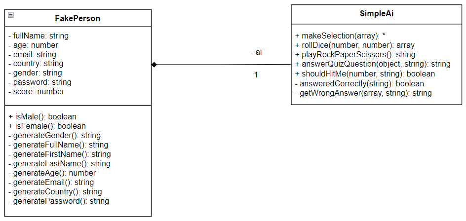
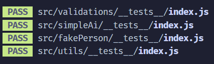
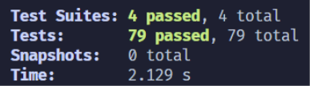
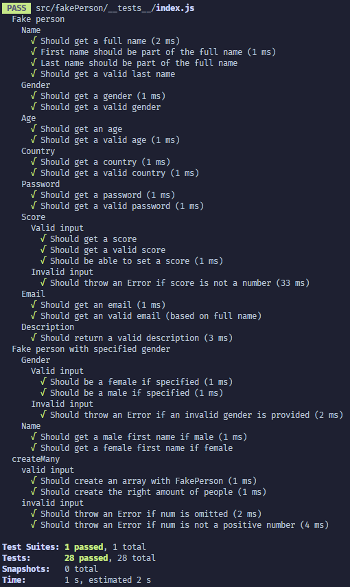
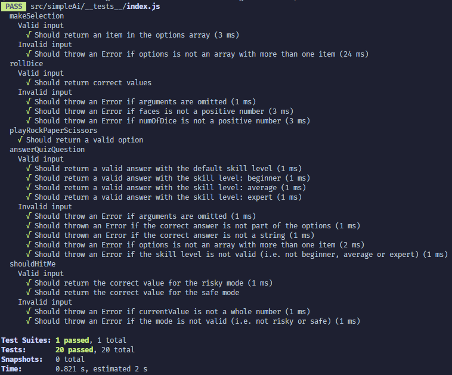
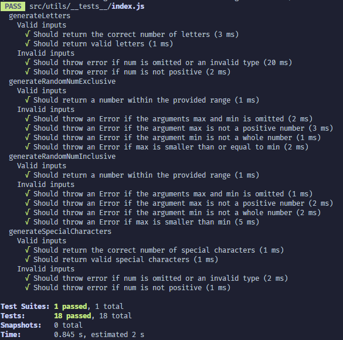
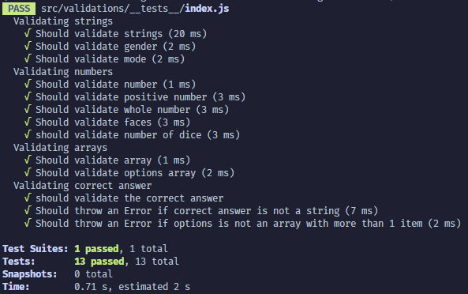
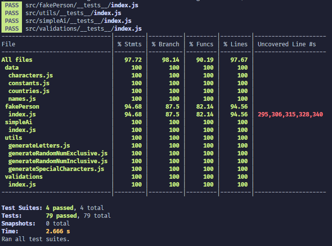

# Mall för inlämning laboration 1, 1dv610
​
## Checklista
  - [x] Jag har skrivit all kod och reflektioner själv. Jag har inte använt mig av andras kod för att lösa uppgiften.
  - [x] Mina testresultat är skrivna utifrån utförd testning ( och inte teoretiskt: "det bör fungera" :) )
  - [x] Koden är objektorienterad
  - [x] Jag har skrivit en modul som riktar sig till programmerare
​
## Egenskattning och mål
  - [ ] Jag är inte klar eftersom jag vet att jag saknar något. (Då skall du inte lämna in! Lämna då istället in på restlaboration.)
  - [x] Jag eftersträvar med denna inlämning godkänt betyg (E-D)
    - [x] De flesta testfall fungerar
    - [x] Koden är förberedd på Återanvändning
    - [x] All kod samt historik finns i git 
    - [x] Kodkvaliterskraven är ifyllda
    - [x] Reflektion är skriven utifrån bokens kapitel 
  - [x] Jag eftersträvar med denna inlämning högre betyg (C-B) och anser mig uppfylla alla extra krav för detta. 
    - [x] Samtliga testfall är skrivna    
    - [x] Testfall är automatiserade
    - [x] Det finns en tydlig beskrivning i hur modulen skall användas (i git)
    - [x] Kodkvalitetskraven är varierade 
  - [x] Jag eftersträvar med denna inlämning högsta betyg (A) 
​
Förtydligande: Examinator kommer sätta betyg oberoende på vad ni anser. 
​
## Återanvändning
<!-- *Beskriv hur du anpassat din kod och instruktioner för att någon annan programmerare skall kunna använda din modul. Om du skrivit instruktioner för din användare, länka till dessa. Om inte, beskriv här hur någon skall göra för att använda din modul.* -->

För att göra det lätt för andra utvecklare att använda min modul, så har jag publicerat det på npmjs.com. Därmed, kan man enkelt installera modulen som ett "dependency" i sin applikation genom att skriva `npm i fake-person` i terminalen.

För de som vill läsa källkoden, så är den organiserad i submoduler där varje funktion/metod och klass har tillhörande JSDOC som förtydligar dess syfte.

Utöver detta, har jag skrivit en [README](https://github.com/je223sv/1DV610-lab-1#readme) där jag går igenom hur man installerar modulen och använder dess publika metoder.
​
## Beskrivning av min kod
<!-- Beskriv din kod på en hög abstraktionsnivå. En kort beskrivning av dina viktigaste klasser och metoder. Skapa gärna ett klassdiagram som bild. Använd det ni lärt er så här långt i 1dv607. Kommunicera så att jag kan förstå. -->

Det finns två klasser i denna modul; `FakePerson` och `SimpleAi`. Med `FakePerson` skapas en “låtsas” person med slumpmässigt genererade egenskaper såsom namn, ålder och kön som kan användas när man behöver “dum” användardata.

Förutom att `FakePerson` är huvudklassen där all funktionalitet utgår ifrån, så är det även en komposit klass som använder sig av `SimpleAi` för metoder som kan användas för att simulera en AI i enklare spel såsom guess the number, the hanging man, rock paper scissors, frågesporter, black jack, osv.

Modulen har dessutom en “utility” och en “validations” submodul med funktioner som används flitigt av dessa klasser för att undvika repetition och för att säkerhetsställa att argument till funktioner är giltiga.

Se [README](https://github.com/je223sv/1DV610-lab-1#readme) för information om alla publika metoder som modulen erbjuder.

## Hur jag testat
<!-- Beskriv hur du kommit fram till om din kod fungerar. -->

För att testa denna modul, så har jag använt testramverket **Jest** och skrivit automatiska enhetstester. Varje "submodul" har sin egna testfil som går att hitta i en `__tests__` map:

Mellan dessa testfiler finns det totalt 79 enhetstester:

Använd `npm test` kommandot i terminalen för att köra samtliga enhetstester, `npm lint` för att analysera kodstandarden och `npm run test:coverage` för att se hur heltäckande testningen är.
​
### Testfall
<!-- Lista de enskilda testfallen. **Fetmarkera** sådant som du själv fyllt i. En rad per testfall. Om ni använder vertyg för testning kan ni ha en bild här med testrapporten. Tänk på att kommunicera till mig. Vad fungerar?, vad fungerar inte? Hur är det testat? Vilka delar testas inte?
​
| Vad testas      | input | output | utfall PASS/FAIL |
| --------- | --------- | ------ | ------- |
|           |           |        |         |
​ -->

Testrapport för `FakePerson` klassen:

Testrapport för `SimpleAi` klassen:

Testrapport för `utils` modulen:

Testrapport för `validations` modulen:

Test coverage:

Baserat på "coverage" rapporten ovan, så är testningen mer eller mindre heltäckande med reservation för ytterligare något "edge case" som möjligen kan dyka upp vid seriös användning av modulen.

Det enda problemet jag stötte på var hur jag skulle testa delegerande metoder utan att upprepa testning. I detta fall, så delegerar `FakePerson` en del arbetsuppgifter till `SimpleAi`. Då metoderna är vältestade i `SimpleAi`, så valde jag att inte testa de delegerande metoderna i `FakePerson` klassen vilket förklarar varför `FakePerson` inte har 100% "coverage".
​
## Kodkvalitetskrav
​
**Fetmarkera** de "regler" som används ur CC. Ni kan frångå tabellformat om ni vill. Skapa direktlänkar till er kod där det är lämpligt. Skriv så att jag kan förstå.
​
### Namngivning
​
|Namn och förklaring | Reflektion  |
|--|--|
| **FakePerson**   Klass för att instansiera “låtsas” personer med slumpmässigt genererade egenskaper och simpla AI förmågor. | **Class Name:**   Enligt Clean Code boken, så ska ett klassnamn bestå av eller innehålla ett substantiv. Eftersom att klasser instansierar objekt som till exempel en student eller ett konto så faller det sig naturligt. I mitt bibliotek, så har jag valt att namnge huvudklassen ``FakePerson`` vilket är helt i linje med denna regel.  **Make meaningful distinction:**  Förutom att använda substantivet "Person" i klassnamnet, så har jag dessutom valt att lägga till prefixen "Fake" för att tydligt särskilja och kommunicera att detta inte är en klass för att instansiera "riktiga" personer utan "låtsas" personer vars egenskaper och beteenden är slumpmässigt genererade. |
|**makeSelection(*options*)** Metod som returnerar ett slumpmässigt element från en array.|**Use intention-revealing name:**  Enligt Clean Code, så innebär denna regel att namnet på funktioner, etc, ska avslöja dess intention. Utan att läsa tillhörande kommentarer, så kanske inte det är alldeles uppenbart att “make selection” sker ur en array och inget annat. Ett bättre och tydligare namn hade möjligtvis varit *selectFromArray()* då man inte hade behövt förlita sig på dokumentationen. *selectRandomItemFromArray()* hade kanske varit ännu tydligare men det hade rubbat illusionen om att det är en person (även om den är fake) som gör ett aktivt val.   **Avoid disinformation:**  Om jag hade döpt denna funktion till “makeASelection” så hade jag adderat onödigt “noise” som varken hade förbättrat läsbarheten eller förståelsen. Och om jag hade döpt funktionen till “makeSelectionFromList” så hade det varit “disinformation” eftersom att funktionen väljer ur en Array och inte en List. Men som namnet är just nu, så anser jag att denna regel respekteras. Dock, så kan namnet ge sken av att den är mer generisk än den i själva fallet är och på sätt klassificeras som “disinformation”.|
|**rollDice(*faces*, *numOfDice*):**  Metod som returnerar en array med resultatet från en eller fler kastade tärningar.|**Make meaningful distinction:**  Om jag hade valt att döpa parametrarna till funktionen ``s1`` och ``s2`` så hade jag gjort en icke-formativ och “meaningless distinction”. Genom att ge var parameter ett “intention-revealing name”, så skapas en “meaningful distinction” mellan dem. I detta fall anser jag att namnen ``faces`` och ``numOfDice`` tydligt särskiljer de båda strängargumenten. Sedan kan man argumentera huruvida man ska vara extra tydlig genom att ge ``faces`` en “numOf” prefix eller inte. I detta fall tyckte jag att det bara skulle addera “noise”.   **Method names:**  En välkänd regel som benämns i Clean Code boken är att metoder/funktioner ska bestå av eller innehålla ett verb. Ur ett logiskt perspektiv är det ytterst passande då metoder/funktioner är operationer som exekveras; det vill säga, den gör något. Med det sagt, så anser jag att namnet på denna funktion följer denna regel då **roll** är ett verb.|
|**playRockPaperScissors()** Metod som simulerar en AI:s val i sten, sax, påse, genom att returnera antingen “rock”, “paper” eller “scissors”.|**Pronounceable names:**   Ur ett kommunikativt perspektiv, så är det viktigt att kunna använda ett lätt språk som alla parter förstår. Eftersom att programmering oftast utförs i lag, så är det därför viktigt att namngivning följer regeln om "pronounceable names" som nämns i Clean Code boken. Namnet på denna funktion anser jag vara ett typexempel på ett "pronounceable" namn. Om jag istället hade valt en akronym (för att spara på ett par karaktärer): typ ``playRPS``, så hade det inte varit lika lätt att kommunicera. Även om vissa akronymer är enklare att förstå än andra, så underlättar det att stava ut hela orden. Tydligheten kommer inte bara att underlätta läsbarheten utan även förståelsen för koden.|
|**shouldHitMe(*currentScore*, *mode*):** Metod som simulerar en AI:s beslut om att ta emot ett nytt kort i spelet Black Jack genom att returnera antingen sant eller falskt baserat på ``currentScore`` och ``mode``.|**Don’t be cute:**  “Hit me” är en term som används i spelet Black Jack och kan således definieras som “cute” då man behöver ha en viss kännedom om spelet Black Jack för att förstå dess betydelse.|

​
### Funktioner
​
|Metodnamn och förklaring | Antal rader  | Reflektion |
|--|--|--|
|**generateRandomNumExclusive(*max*, *min*):**  Metod som returnerar ett slumpmässigt nummer mellan ``max`` och ``min`` där ``max`` är exklusiv.|26|**Do one thing/Small!:** Till en början, så valde jag att namnge denna funktion *generateRandomNum(max, min)*. När jag insåg att ``max`` antingen ska kunna vara exklusiv eller inklusiv, så funderade jag huruvida funktionen skulle hantera både fallen genom att lägga till ytterligare en parameter i form av en boolean som skulle avgöra om ``max`` ska vara exklusiv eller inte. Men någonstans i bakhuvudet ekade denna regel om att en funktion ska göra en sak. Instinktivt, så valde jag att dela på denna funktion. På så sätt fick jag en "Small!" och "dyadic" funktion som gör en sak, och det gör den bra!  **Don’t repeat yourself:**   Eftersom att mitt bibliotek skapar en “fake” person med slumpade egenskaper, så existerade det till en början logik som genererar random värden i var och varannan metod. Genom att förflytta logiken till denna funktion, så undvek jag repetition samtidigt som funktionerna blev mindre och abstraktionsnivån högre.  **Use descriptive name:** I mitt bibliotek, så är detta funktionen som har längst namn. Enligt boken, så ska man inte vara rädd för långa namn om det beskriver funktionens intention på ett tydligt sätt, vilket jag anser denna funktion gör. Dessutom, så ska man helst återanvända samma ord när man namnger sina funktioner vilket också nämns i **“pick one word per concept”** regeln från kapitel 2. Då samtliga funktioner som returnerer ett "random" värde, inklusive denna, har prexifen "generate", så anser jag att namnet på denna funktion inte bara är beskrivande utan även konsekvent. Kort och gott, så vet du vad du får.|
|**rollDice(*faces*, *numOfDice*):** Metod som returnerar en array med resultatet från en eller fler kastade tärningar.|8|**One-level Abstraction:** När det kommer till denna regel, så måste jag säga att jag misslyckades här. I efterhand, anser jag att funktionen hade blivit enklare att tyda om jag hade valt att skapa en getRolls eller generateRolls funktion som tar hand om [for loopen](https://github.com/je223sv/1DV610-lab-1/blob/a5bd86a0ea22dee4f19a5106e78714904e84a7b1/src/simpleAi/index.js#L43) som betraktas som "low-level" kod. På så sätt hade jag separerat "high" och "low" nivån på koden samtidigt som jag hade fått en "Small!" funktion.  **Use descriptive name:** ``rollDice`` tycker jag är ett väldigt "descriptive name" eftersom det förklarar tydligt vad funktionen gör. Den kastar tärningar. Varken mer eller mindre.|
|**playRockPaperScissors()** Metod som simulerar en AI:s val i sten, sax, påse, genom att returnera antingen “rock”, “paper” eller “scissors”.|21|**Function arguments:** Enligt boken, så är inga argument det bästa då det minskar funktionens komplexitet. Från den synvinkeln, så är denna "niladic" funktion bra.  **Don’t repeat yourself:** Vid en närmare titt så är denna funktion snarlik makeSelection. Skillnaden är att valmöjligheterna (rock, paper eller scissors) är bestämd i denna funktion medans de kan skjutas in i ``makeSelection`` som en array. Förutom detta så är de snudd på identiska. Det bästa hade förmodligen varit att använda ``makeSelection(['rock', 'paper', 'scissors'])`` intern i denna funktion. Förutom att undvika repetition, så hade jag även lyft abstraktionsnivån. Jag hade även kunnat ta bort denna funktion och nöjt mig med ``makeSelection`` och ge tips i dokumentationen att funktionen kan bland annat användas till att simulera en AI's val i spel som sten, sax, påse.|
|**answerQuizQuestion({ *options*, *correctAnswer* }, skillLevel):** Metod som simulerar en AI:s svar på en frågesportsfråga genom att returnera ett element från den tillhandahållna ``options`` arrayen. Sannolikheten att det returnerade elementet är lika med ``correctAnswer`` baseras på ``skillLevel``.|18|**Function arguments:** Enligt Clean Code boken, så är det sällan bra att ha mer än tre argument. Ett sätt att minska antalet argument är att använda "argument objects". Om ``options`` och ``correctAnswer`` varit individuella argument, så hade jag fått en triadic funktion. Istället, så ansåg jag att dessa förmodligen hör ihop i ett större sammanhang, såsom i ett frågeobjekt, och kan således skickas tillsammans. Därmed fick jag en dyadic funktion istället för en triadic. Jag vill också passa på att säga att det var ett aktivt val att "destruct:a" objektet i parameterlistan då jag tycker att det kommunicerar tydligare vilka "keys" som objektet förväntas ha.  **One-level abstraction:** För att bättre följa denna regel, så hade jag behövt flytta [if-satsen](https://github.com/je223sv/1DV610-lab-1/blob/a5bd86a0ea22dee4f19a5106e78714904e84a7b1/src/simpleAi/index.js#L75) till en egen funktion och kallat den för till exempel getAnswer eller generateAnswer.|
|**#getWrongAnswer(*options*, *correctAnswer*):** Metod för att returnera "fel" element från ``options``. Det vill säga, det element som inte är lika med ``correctAnswer``.|14|**Have no side-effects:** Den första iteration av denna funktion hade en sidoeffekt då den förutom att returnera ett “wrong answer” även modifierade ``options`` arrayen som skickades med. Jag blev medveten om denna sidoeffekt när jag testade vilket visar på hur viktigt testning är. Sidoeffekten eliminerades genom att skapa och använda en kopia av den ursprungliga arrayen.|
​
## Laborationsreflektion
<!-- Reflektera över uppgiften utifrån ett kodkvalitetsperspektiv. Använd begrepp ifrån boken.  -->

På förhand kan man lätt tro att namnge saker ska vara enkelt. Det skulle visa sig ligga en hel vetenskap bakom detta. Det finns ett känt citat som lyder *"There are only two hard things in computer science: cache invalidation and naming things"* och jag förstår poängen.

I början av min programmingskarriär, så låg all fokus på att få koden att fungera. Bara jag förstod den, så spela det ingen roll vad den kommunicerade. I takt med att jag blivit mer utbildad och genom att läsa kapitel som “Meaningful Names”, så har jag fått en större förståelse för hur viktigt det är att skriva kod som folk kan läsa och förstå. Det underlättar inte bara för andra utan även för en själv. Ofta har det hänt att man programmerat något som man förstår i stunden men som blivit totalt obegripligt när man besöker koden igen efter någon vecka. Att “write for the reader”, vare sig det för en annan människa eller ditt framtida jag, är något jag kommer att bära med mig.

**Kapitel 2** introducerar många bra regler och vissa av dessa regler hade man kännedom om innan, såsom att klasser ska vara ett substantiv och att funktioner ska vara verb. Sedan finns det andra regler som **“use intention-revealing names”** och **“avoid disinformation”** som jag har fått en djupare förståelse för. Man kan tro att man är tydlig, men jag har verkligen lärt mig att man måste studera ett namn från alla möjliga vinklar för att se huruvida det kan misstolkas. Ett exempel på detta är funktionen ``makeSelection`` som jag tyckte var ett väldigt tydligt och bra namn. Efter reflektion, så insåg jag att det kanske inte var så tydligt att den väljer från en Array och inget annat. Man inser snabbt att det är en balansgång mellan att vara övertydlig och hur mycket man ska förlita sig på kommentarer för att kommunicera intent.

Efter att ha läst **kapitel 3**, så kan jag konstatera att det har funnits en del brister i mitt sätt att skapa funktioner. För det första har jag aldrig tänkt på att ha en och samma abstraktionsnivå (**one level of abstraction per function**) i en funktion. Genom att följa denna regel, så blir funktionen inte bara enklare att läsa och förstå men även **"Small!"** på köpet om man har tur. Förvisso bryter jag mot denna regel i någon funktion vilket jag har påpekat i sektionen ovan. Men faktumet att jag nu, via reflektion, är medveten om att denna regel bryts och kan gå tillbaka och korrigera för att förbättra koden tyder ju ändå på att man lärt sig något. En annan sak jag ska tänka på framöver är att försöka ha så få parametrar som möjligt. Vad jag vet, så tillåter jag som mest två argument (dyadic) till mina funktioner i biblioteket, och det är jag nöjd med. En annan sak som jag tyckte var briljant var att byta ut krångliga uttryck i if-satser mot funktioner vars namn har en “is” prefix.

En regel som jag alltid försöker att följa är **Don’t repeat yourself**. Tyvärr, så missade jag att [generateLetters](https://github.com/je223sv/1DV610-lab-1/blob/a8590265abe4675a5ec21310d760be3eec858fb0/src/utils/generateLetters.js#L11) och [generateSpecialCharacters](https://github.com/je223sv/1DV610-lab-1/blob/a8590265abe4675a5ec21310d760be3eec858fb0/src/utils/generateSpecialCharacters.js#L11) mer eller mindre har samma implementation. I en nästföljande version, så hade jag skapat en generateCharacter funktion som de båda använder för att minimera kodupprepningen.

Summa summarum, så har jag lärt mig otroligt mycket från denna laboration och kapitel 2-3 i boken. Även om min kod inte är perfekt i nuläget, så hade jag nu kunnat förbättra den utifrån denna reflektion. Detta om något bevisar hur viktigt det är att ta ett steg tillbaka och granska din kod för att göra den enklare att läsa och förstå.